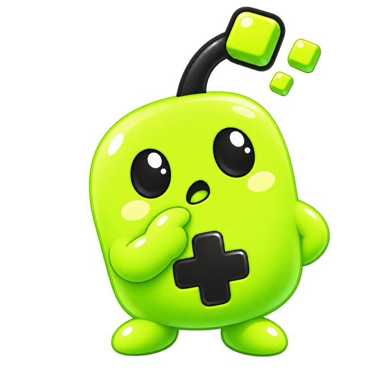

<div align="center">
  

# PatchMe

**Trasforma amici, persone e situazioni in patch notes da condividere.**

[](https://patchme-fabiozagariadev.vercel.app)
[](#uso-dellintelligenza-artificiale)
[](https://patchme-fabiozagariadev.vercel.app)
[](https://t.me/patchmegame)

[Prova PatchMe](https://patchme-fabiozagariadev.vercel.app) · [Aggiornamenti Telegram](https://t.me/patchmegame)
</div>

## Cos'è PatchMe

PatchMe trasforma amici, persone, momenti e cambiamenti della settimana in finte patch notes ispirate agli aggiornamenti dei videogiochi.

Puoi raccontare novità, miglioramenti, problemi risolti, bug ancora aperti e ciò che vuoi aggiungere nella tua prossima versione. Alla fine ottieni una scheda grafica pronta da salvare e condividere.

Il progetto è mobile-first, non richiede registrazione e conserva i dati direttamente nel browser.

## Funzionalità

- tutorial introduttivo accessibile con esempi e configurazione iniziale;
- creazione libera oppure guidata tramite cinque domande;
- domanda settimanale di Patchy, trasformabile subito in una patch e condivisibile con gli amici;
- profilo giocatore locale con livelli, XP, titoli sarcastici, serie settimanale e statistiche;
- notifiche e animazioni per XP guadagnati e passaggi di livello;
- coda delle notifiche: ogni messaggio resta visibile per cinque secondi completi;
- missioni, trofei e ricompense XP, incluso un easter egg segreto;
- missioni giornaliere e settimanali rinnovabili con ricompense permanenti;
- venti titoli sarcastici e numerosi easter egg dedicati ai videogiochi leggendari;
- pagina Progressione separata dall'archivio delle patch;
- validazione minima di 3 caratteri per le voci pubblicate;
- patch in stato bozza o pubblicata;
- sezioni predefinite, personalizzabili e riordinabili;
- elementi testuali multipli per ogni sezione;
- visibilità separata delle sezioni nelle immagini condivise;
- quattro template grafici con anteprima ed esportazione della patch come immagine;
- archivio locale con modifica ed eliminazione;
- temi chiaro, scuro e sincronizzato con il dispositivo;
- colori principali personalizzabili;
- avatar del profilo selezionabile tra quattro pose di Patchy;
- nome visualizzato validato e limitato a cinque modifiche giornaliere;
- condivisione nativa di immagine, messaggio e link con fallback;
- sezione Novità e collegamento al canale Telegram;
- PWA installabile con icone dedicate;
- interfaccia responsive e ottimizzata per smartphone.

## Patchy

Patchy è la mascotte ufficiale di PatchMe: una piccola creatura digitale nata da un aggiornamento.

Il simbolo `+` rappresenta miglioramenti e nuove funzionalità, mentre i pixel dell'antenna reagiscono ai diversi momenti dell'app.

| Classico                                            | Pensieroso                                              | Festeggia                                               | Bug trovato                                     |
| --------------------------------------------------- | ------------------------------------------------------- | ------------------------------------------------------- | ----------------------------------------------- |
|  |  |  |  |

## Stato del progetto

PatchMe è attualmente in **0.5.0 Alpha**.

Il flusso principale funziona, ma struttura, interfaccia e funzionalità possono ancora cambiare. In questa fase il progetto viene testato con un gruppo ristretto di persone e sviluppato a partire dal loro utilizzo reale.

### Limiti attuali

- i dati sono salvati soltanto nel browser utilizzato;
- cancellando i dati del sito si perdono impostazioni e patch;
- non esistono ancora account o sincronizzazione tra dispositivi;
- i link pubblici alle singole patch non sono ancora disponibili.

## Roadmap

### Prossimi aggiornamenti

- pagine pubbliche per le patch;
- achievement e recap periodici;
- nuove pose ed espressioni di Patchy.

### Più avanti

- autenticazione e recupero dell'account;
- database e sincronizzazione tra dispositivi;
- profili, lore personale e personaggi collegati;
- reazioni tematiche e patch di gruppo;
- applicazione Android.

## Privacy

La versione Alpha non invia le patch a un server. Impostazioni e contenuti restano nel `localStorage` del dispositivo, salvo quando l'utente decide volontariamente di esportare o condividere un'immagine.

## Uso dell'intelligenza artificiale

PatchMe è un progetto sviluppato con il supporto di strumenti di intelligenza artificiale.

L'AI è stata utilizzata per assistere la progettazione, la generazione e revisione del codice, la scrittura di alcuni contenuti e la creazione delle immagini di Patchy. Idea, direzione del prodotto, scelte funzionali, test e decisioni finali sono curati da [Fabio Zagaria](https://github.com/fabiozagaria).

Il codice generato o suggerito viene verificato tramite build, lint e test manuali prima della pubblicazione.

## Stack tecnico

- React 19 e TypeScript;
- TanStack Start e TanStack Router;
- Vite;
- Tailwind CSS;
- Radix UI;
- Zod;
- `html-to-image`;
- Vercel per il deploy.

## Avvio locale

Requisiti:

- Node.js;
- npm.

```bash
git clone https://github.com/fabiozagaria/patchme-game.git
cd patchme-game
npm install
npm run dev
```

Comandi disponibili:

```bash
npm run dev      # server di sviluppo
npm run build    # build di produzione
npm run preview  # anteprima della build
npm run lint     # controllo del codice
npm run format   # formattazione
```

## Struttura principale

```text
src/
├── components/   Componenti dell'interfaccia e Patchy
├── config/       Configurazione centrale dell'app
├── lib/          Modelli, validazione, persistenza ed esportazione
├── routes/       Pagine TanStack Router
└── state/        Stato globale dell'app

public/
└── assets/       Mascotte, pose e icone installabili
```

## Feedback

PatchMe cresce attraverso utilizzo reale e feedback concreti. Se trovi un bug o hai un'idea, puoi segnalarla tramite GitHub oppure seguire gli aggiornamenti su [@patchmegame](https://t.me/patchmegame).

---

<div align="center">
  Creato da <a href="https://github.com/fabiozagaria">fabiozagariadev</a> con l'aiuto di Patchy 💚
</div>
